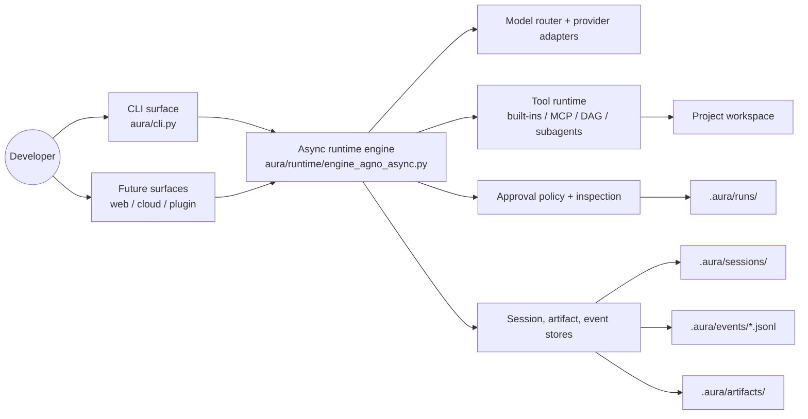

# Aura

[](https://github.com/qWaitCrypto/Aura/actions/workflows/ci.yml)
[](https://www.python.org/)
[](LICENSE)
[](https://github.com/qWaitCrypto/Aura)

Aura is a local-first AI agent framework for developers who want **approval-gated execution, auditable state, and resumable workflows** without giving up modern tool calling or model flexibility.

Built on top of [Agno](https://github.com/agno-ai/agno), Aura focuses on the part most agent demos skip: making agent behavior inspectable, replayable, and safe enough to use in real project directories.

## Why Aura stands out

- **Local-first project state**: sessions, runs, approvals, and artifacts live under `.aura/`, so workflows stay versionable and reproducible.
- **Approval gates for risky tools**: read-only operations can flow fast, while shell or sensitive actions stop for explicit approval.
- **Append-only audit trail**: every model response, tool call, and approval event is persisted as JSONL for replay and debugging.
- **Resumable runs**: interrupted tool loops can pause to disk and continue later, including cross-process recovery.
- **Multi-surface runtime**: the same engine can back a CLI today and web, cloud, or editor surfaces later.
- **Extensible orchestration layer**: built-in tools, MCP servers, skills, DAG execution, and delegated subagents share one runtime model.

## Architecture



## Quick start

```bash
git clone https://github.com/qWaitCrypto/Aura.git
cd Aura

python -m venv .venv
source .venv/bin/activate
python -m pip install --upgrade pip
python -m pip install -e ".[dev]"

aura init demo-workspace
```

Edit `demo-workspace/.aura/config/models.json` and set the provider credentials and model you want to use, then start a session:

```bash
cd demo-workspace
aura chat
```

Run the integration suite:

```bash
python -m pytest -q -p no:cacheprovider scripts/integration
```

## Core capabilities

| Capability | What Aura adds |
| --- | --- |
| Tool execution | Approval-aware execution, inspection previews, and persisted tool results |
| Session memory | Event replay, compaction, and resumable runs stored on disk |
| Multi-model routing | OpenAI-compatible, OpenAI Codex, Anthropic, and Gemini adapters |
| Delegation | Subagents and DAG-based work orchestration with approval passthrough |
| Extensibility | Skills, MCP integration, optional knowledge retrieval, surface abstraction |

## Repository layout

```text
aura/
├── cli.py                     # CLI entry point
├── runtime/                   # Engine, routing, tools, storage, orchestration
├── surfaces/                  # Surface stubs for future web/cloud adapters
└── ui/                        # Console rendering

scripts/
├── integration/               # Integration tests
├── mcp_smoke_server.py        # Local MCP smoke server
├── mcp_smoke_client.py        # MCP smoke client
└── smoke_agno_engine.py       # End-to-end smoke runner
```

## Development

See [CONTRIBUTING.md](CONTRIBUTING.md) for setup, testing, and commit conventions.

## Project status

Aura is currently **CLI-first and actively evolving**. The runtime already includes:

- async tool loops
- approval-aware execution
- MCP tool loading
- resumable runs
- delegated subagents
- DAG execution primitives

The main focus now is polishing the open-source surface area: packaging, CI, docs, and contributor ergonomics.

## License

[MIT](LICENSE)
